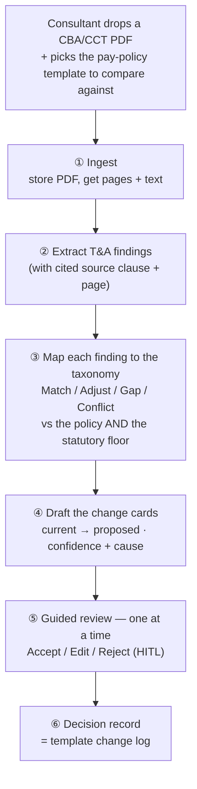
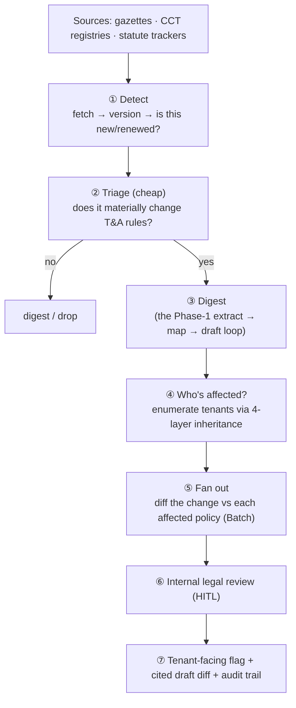

# LawTrack AI — Agent Plan

> **PM step 3 of 3** ([pain points](pain-points.md) → [document types](document-types.md) → **agent
> plan**). What the agent actually *does* — the work of digesting one document, and (only after that
> works) how it scans for new ones. The technical "how" on the Claude API is [`technical-design.md`](technical-design.md).
>
> **Sequencing is the whole point** (per Assaf, 2026-07-15): **Phase 1 — nail uploading one PDF and
> digesting it. Phase 2 — the scanner — comes *only after* Phase 1 works.** This doc keeps them apart
> deliberately; Phase 2 reuses the entire Phase-1 digest loop.

---

## Phase 1 — Digest one uploaded document (the foundation)

This is **manual-upload mode** and it is the whole v1. Get this right end-to-end before anything
scans. The agent's job on a single dropped PDF:

**Step-by-step, and where the agent vs the human acts:**

| Step | Agent does | Human does | Trust mechanism |
|--:|:--|:--|:--|
| ① Ingest | Store the PDF, read pages + text (native + OCR for scans) | Upload; **pick the comparison policy template** (gates the run) | — |
| ② Extract | Find every T&A/pay clause; emit one **finding** per rule (a clause can yield several) with the **verbatim source quote + page** | — | Every finding cites its exact clause |
| ③ Map | Classify each finding Match/Adjust/Gap/Conflict against the chosen policy **and** the statutory floor; land it on a pay-policy **tab + field** | — | The 17-capability taxonomy is the fixed target; Gaps/Conflicts flagged |
| ④ Draft | Produce the change card: current → proposed, rationale, **confidence + its cause** | — | Low-confidence cards point to the source clause |
| ⑤ Review | Present cards **one at a time** | **Accept / Edit / Reject each** — nothing lands unreviewed | Guided queue; bidirectional PDF↔card link |
| ⑥ Record | Write the decision (card + verdict + citation + who/when) | — | Durable, revisitable across renewals |

**The agent proposes; it never applies.** HITL on every card is non-negotiable (liability feature).
Bulk-accept / auto-apply are deliberately not built. Confidence carries its *cause* so the reviewer can
interrogate every recommendation.

**What "done" for Phase 1 looks like:**
- A consultant drops a real Brazil CCT, picks a template, and gets a cited, reviewable diff in minutes.
- Extraction ≥ ~80–90% clause recall on the golden set; mapping precision high enough that reviewers
  trust it (false positives are the killer — tune precision, sweep recall to a digest).
- The decision record is the pay-policy template change log.

**This is the gate.** Everything in Phase 2 depends on this loop being reliable and trusted. Do not start
the scanner until the digest loop is design-partner-validated.

---

## Phase 2 — Scan for new documents (the monitor)

**Only after Phase 1 works.** Auto-detect mode adds a front end that *finds* documents and a back end
that *fans the digest out across affected tenants* — but the middle (extract → map → draft) is the exact
Phase-1 loop, unchanged. It also carries a permanent ops line (legal curation) — which is itself the moat.

**Step-by-step:**

1. **Detect.** Watch per-jurisdiction sources (Brazil: *Sistema Mediador* for CCT/ACT renewals, *Diário
   Oficial* for statute/reform; other jurisdictions later). Fetch, version, and decide "is this new or a
   renewal of something we track?" (Content hashing + version compare — mostly plumbing, not the model.)
2. **Triage (cheap).** A fast, low-cost pass: *does this document materially change T&A/pay rules, or is
   it noise?* Kills the volume before spending on full extraction. (Cheapest model — see technical-design.)
3. **Digest.** On a material change, run the **Phase-1 loop** (extract → map → draft). Nothing new here —
   that's the point of sequencing.
4. **Who's affected.** Enumerate the tenants/policies the change touches via the four-layer inheritance
   (a DB query, *not* the model) — the answer no generic service can give (pain P5). **Hard dependency:
   versioned 4-layer templates must exist.**
5. **Fan out.** Diff the change against each affected tenant's current policy — **in bulk via the Batch
   API** (a prospect's 72 instruments, or N tenants under one renewed CCT, in one run at 50% cost).
6. **Internal legal review (HITL).** Findings go to an internal legal-curation queue *before* any tenant
   sees them — the ops line, and the reason "never DIY" holds.
7. **Tenant-facing flag.** The affected tenant sees a flag + the cited draft diff + audit trail, one click
   into the same Phase-1 review surface.

**Precision over recall, always.** False positives destroy trust — tune the flag for precision; sweep the
long tail of maybe-changes into a periodic digest rather than firing individual alerts.

**Phase 2 dependencies (beyond Phase 1):**
- **Versioned 4-layer policy templates** — required for steps ④ and ⑤ (enumerate + diff against a
  country-layer template). This is the hard gate; sequence Phase 2 behind it.
- **Source ingestion coverage** — which registries/gazettes are fetchable per jurisdiction (open question).
- **Ops staffing** — ~0.5–1 FTE legal-curation per major jurisdiction cluster (the recurring moat cost).

---

## The one-line sequencing rule

> **Build and validate "digest one PDF" (Phase 1) before building "find the PDFs" (Phase 2).** The
> scanner is worthless if the digest it feeds isn't trusted — and the scanner reuses that digest wholesale.
