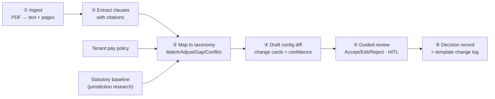

# LawTrack AI — Capability Spec

> Build reference for **AI Feature #3 — LawTrack AI** (absorbs the former #2 CBA/CCT Reader). One
> ingestion → extraction → mapping → gap-map → draft-config engine over labor-rule sources, in two
> modes. **Start now** per the [roadmap](../strategy/roadmap.md); to be built **production-ready on the
> Claude API** ([`technical-design.md`](technical-design.md)).
>
> **Status:** design draft, 2026-07-15. Sources: catalog #3 ([`../strategy/ai-feature-ideas.md`](../strategy/ai-feature-ideas.md#3-lawtrack-ai--read-any-labor-rule-source-flag-what-changed-draft-the-config)),
> deep-dive ([`../strategy/ai-features-deep-dive.md`](../strategy/ai-features-deep-dive.md#2--3-lawtrack-ai--read-any-labor-rule-source-flag-what-changed-draft-the-config)),
> the CBA-ingestion tool design (`../../Modular-calculation/requirements/cba-ingestion-tool.md`), and the
> validated support matrix (`../../context/worldwide-calculations/brazil-cct-support-matrix.md`).
> Runnable mockup: [`../prototypes/lawtrack-ai/`](../prototypes/lawtrack-ai/) (port 3000).
>
> **PM track:** [`pain-points.md`](pain-points.md) · [`document-types.md`](document-types.md) ·
> [`agent-plan.md`](agent-plan.md) · [`technical-design.md`](technical-design.md) · [`prd.md`](prd.md).

---

## §1 Framing — what it is, and why day.io specifically

Labor rules live in documents — statutes, and **collective agreements** (Brazil CCT/ACT, France
CCN, Germany Tarifvertrag, US CBAs). Inside a long legal PDF sit a handful of clauses that actually
change how time is paid (an OT premium, a night differential, a rest rule, a consecutive-days bonus),
buried among dozens about union dues and grievance procedures that never touch the calculation engine.
Today a human reads the whole thing, guesses which clauses matter, and hand-edits a pay policy — slow,
error-prone, and **recurring**, because agreements renew (often yearly) and statutes churn constantly.

**LawTrack AI reads the document, points at the exact clauses that matter, maps each to the engine's
capability taxonomy, and drafts the precise pay-policy config change — every recommendation traced to
the clause that justifies it, with a human in the loop on every decision.**

**Why this is day.io's to win, not a generic doc-reader's:**

1. **Extraction is commodity; mapping is the product.** Pulling OT bands and rest rules out of a PDF is
   near-commodity LLM work (~80–90% clause accuracy) — any competitor or IT team can do it. **Mapping**
   each rule onto a *verified engine's* capability taxonomy and drafting the actual config is un-DIY-able:
   there is nothing to map onto without the engine. Our premium-stacking taxonomy and the
   `worldwide-calculations/` research are the structural advantage.
2. **We can answer "which tenants are affected."** The four-layer policy inheritance
   (country → state/workplace → company → policy) makes affected descendants enumerable *by construction*.
   No generic compliance-news service can say which policies a change touches — that answer is ours.
3. **We already validated the classification on real agreements.** The Grupo Boticário run — **72
   instruments / 63 CCTs** classified against 17 capabilities (`brazil-cct-support-matrix.md`) — is both
   proof it works and a ready-made **golden eval set**.

**The un-negotiable positioning:** ship as a **cited draft for expert legal review**, never as
"auto-configuration." Human-in-the-loop is a *liability feature*, not a weakness. And **false positives
kill this feature** — tune for precision, sweep recall into a periodic digest.

---

## §2 Scope line — the T&A/pay layer, not the whole agreement

| In scope (read + map) | Out of scope (surface, don't act) |
|---|---|
| T&A/pay clauses: OT bands, night premium, rest rules, hours bank, Sunday/holiday, tolerance, on-call, shift scales | Union dues, grievance procedures, social-fund clauses (⚪ Irrelevant — dimmed, not hidden) |
| Mapping each to a pay-policy tab + field; drafting current → proposed | **Legal interpretation** — effective dates, transition rules, whether a clause legally derogates from statute (stays human) |
| Flagging capability **gaps** (rule with no home in the engine) | Money/benefit clauses outside the hour layer (bonuses, PLR) — logged, not configured |
| Flagging statutory **conflicts** (clause diverges from the floor) — warn, never block | Applying the change to the live policy without human sign-off (never) |

**Deliverable of a run:** a reviewed comparison — the marked-up source, the per-clause change cards,
and a durable decision record (= the pay-policy template change log). What happens *after* review
(stage draft · apply · export change-set) is a deliberate open question (§11).

---

## §3 The pipeline at a glance



Identical whichever way a document arrives (§7); what differs is the **trigger** and the **comparison
baseline**. The deep mechanics of ①–④ on the Claude API are in [`technical-design.md`](technical-design.md).

---

## §4 The classification model (the 5 colors) + the findings data model

Every passage is tinted by how it relates to the pay policy **and** the statutory floor:

| Color | Category | Meaning | Card |
|---|---|---|---|
| ⚪ | **Irrelevant** | Not a T&A/pay rule | none |
| 🟢 | **Match** | CBA rule already = policy | confirmation |
| 🟡 | **Adjust** | Maps to an existing field, different value (night 20% → 25%) | change card |
| 🔴 | **Gap** | No home in the policy/schema — net-new calc or product change | change card + gap flag |
| 🟣 | **Conflict** | Diverges from a statutory floor/ceiling — legal risk | warning card (warn, **never block**) |

**Gap and Conflict carry the most weight.** Gaps are exactly the material of
`unsupported-calculations.md` / `candidate-calculations.md` — so LawTrack doubles as a **live feeder of
capability gaps found in real agreements.** Conflicts are legal risk: surface which floor, by how much,
require explicit acknowledgment to proceed (CBAs can legally derogate; day.io is not the legal authority).

Every finding carries this contract (the object the source panel and the change card share):

```text
Finding = {
  classification,        Match | Adjust | Gap | Conflict
  policy_target,         tab + field (e.g. Hours Distribution → night premium)
  current → proposed,    the value change (empty "current" for author-mode / Gap)
  source_quote + page,   the exact clause phrase, cited (the trust mechanism)
  rationale,             why this clause implies this change
  confidence,            High | Med | Low
  confidence_basis       WHY that sure — explicit clause · inferred field ·
                         ambiguous wording · shaky extraction · no direct field
}
```

Confidence **and its cause** on every card — the reviewer never sees a bare score they can't
interrogate; low-confidence cards point straight to the source clause.

---

## §5 The mapping target — the capability taxonomy

Findings map onto the **17-capability taxonomy** (validated across the Boticário portfolio), grouped by
the pay-policy tabs the reviewer edits. Full column definitions + support baseline:
`../../context/worldwide-calculations/brazil-cct-support-matrix.md`.

| Tab | Capabilities |
|---|---|
| **A · Paid Overtime** | standard-hours target · daily OT (phased tiers) · weekly/monthly OT · banco de horas · bank→pay/rescission · Sunday/holiday premium · rest-day rotation |
| **B · Hours Distribution (night)** | adicional noturno · night prorrogação · hora noturna reduzida |
| **C · Tolerance** | tolerância / minutos residuais |
| **D · On Call** | sobreaviso / prontidão |
| **E · Breaks & rest** | intrajornada · interjornada 11h |
| **F · Schedule / scale** | 12×36 · semana espanhola |
| **G · Absences** | faltas abonadas |

The taxonomy is jurisdiction-extensible: France CCN / Germany TV add capability families (+1–2 eng-months
each, mostly taxonomy + eval, not new infrastructure). **Finding:** across 72 real Boticário instruments,
**zero hard ❌ gaps** — every delta is supported today or a known config/roadmap ⚠️.

---

## §6 The review surface — guided, cited, durable

- **Guided, one-at-a-time queue.** High-stakes, low-frequency work — the tool walks the reviewer
  card-by-card (**Accept / Edit / Reject**); **nothing lands until reviewed**. Bulk-accept / auto-apply
  are deliberately *not* the model — guidance beats throughput when a wrong pay rule is expensive.
- **Bidirectional source link.** Click a change card → the exact clause highlights in the rendered PDF;
  click a passage → its cards list. Nothing on the right exists without a passage on the left. This is
  what makes a legally-loaded recommendation reviewable ("our user can't be wrong").
- **Dim, don't hide.** Irrelevant text stays visible (greyed) so the reviewer trusts nothing was dropped.
- **Decision record = template change log.** Every Accept/Edit/Reject is recorded with citation +
  rationale + who + when — revisitable within the session and **across renewals** (next year's reviewer
  sees "25% because 2025 §12" instead of starting blind). Same object as the pay-policy template change log.

---

## §7 Two modes, one engine

| Mode | Trigger | Comparison baseline | Real-world job |
|---|---|---|---|
| **Manual upload** (reader) | User drops a CBA/law PDF | User **must pick** the pay-policy template to compare against (no monitored context) | Onboarding + pre-sales support-matrix; **v1** |
| **Auto-detect** (monitor) | Agent watches statutes/gazettes + auto-renewing CBAs/ACTs | New/renewed version vs the **tenant's current configured policy** (affected policies enumerable via 4-layer inheritance) | The compliance radar; **Phase 2** |

Author-mode ("stand up a policy from scratch") = the reconcile engine run against an **empty** policy —
it falls out for free. Full sequencing + how the monitor scans for new documents: [`agent-plan.md`](agent-plan.md).

---

## §8 Built on the Claude API (production)

This is a **real product built on the Claude API** — see [`technical-design.md`](technical-design.md)
for the production architecture: PDF input (Files API), clause extraction with **citations**, structured
findings via **strict tool use**, the mapping/drafting prompts, **prompt caching** of the taxonomy +
policy schema, the **Batch API** for portfolio/monitor fan-out, model-per-stage selection, eval harness
(the 72-instrument golden set), and the citations-vs-structured-output constraint and how we resolve it.

---

## §9 v1 scope boundary

| In v1 (manual upload, ~1 quarter to design-partner) | Deferred |
|---|---|
| **Manual-upload reader** — drop a PDF, pick a policy template, get the cited diff | **Auto-detect monitor** (Phase 2, +the ops line) |
| Extraction + mapping over the 17-capability taxonomy (Brazil first) | Global taxonomy families (France CCN, Germany TV) — +1–2 em each |
| 5-color findings + confidence-with-cause + guided review | Learning from reviewer overrides |
| Cited draft + decision record | Post-review commit step (stage / apply / export) — open (§11) |
| Eval harness on the 72-instrument golden set | Scanned/image PDFs, side-letters, multi-column tables at full fidelity |

Reader ≈ **8–10 eng-months** (one squad-quarter to design-partner, no ops tail); full monitor ≈ **12–15
em / ~1.5 quarters** on top (deep-dive #3).

---

## §10 Dependencies

| Dependency | Status | Why it matters |
|---|---|---|
| **Rules taxonomy + golden set** | ✅ exists — `brazil-cct-support-matrix.md` (72 instruments) | Extraction schema + eval harness are largely free |
| **Pay-policy config schema** | ✅ current-state — `pay-policy-configuration.md` (6 tabs) | The mapping target ("which field") |
| **Statutory baselines** | ✅ per-jurisdiction — `worldwide-calculations/<country>.md` | Required for 🟣 Conflict detection |
| **Versioned 4-layer policy templates** | ⚠ in flight | **Hard dependency for Phase 2** — enumerating affected tenants + drafting against a country-layer template |
| **Claude API access** | to provision | The engine LawTrack runs on ([`technical-design.md`](technical-design.md)) |

---

## §11 Open questions

1. **Post-review commit** — where accepted changes land: staged draft (new policy version) vs standalone
   change-set producer. Leaning staged draft; not locked.
2. **Citations + structured output** — the two can't both be on in one API call (§8 / technical-design):
   confirm the two-pass vs tool-use-with-source-quote approach on real CCTs.
3. **Reviewer overrides — record only, or learn?** When a reviewer edits/rejects a classification.
4. **Scanned / image PDFs** — OCR quality bar for real-world Brazilian CCTs (multi-column, tables, appendices).
5. **Monitor source coverage** — which gazettes/registries per jurisdiction, and the crawl vs feed model
   ([`agent-plan.md`](agent-plan.md)).
