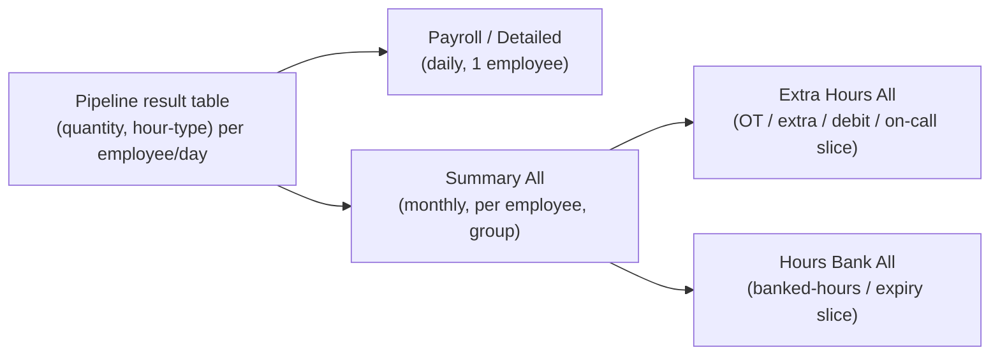

# Reports Knowledge

> **On-demand** — the single home for **how day.io's exported reports look**: the four report
> types, their grain/scope, and a column-by-column glossary tying each field back to the calculation
> pipeline's **Rollup & output** step and the event catalog in `../flow/payroll-event-types.md`.
> The raw source spreadsheets and a faithful per-report rendering live beside this file.
>
> **What these reports are, in the pipeline.** They are the **output surface** of the engine — the
> "Rollup & output" step (`../flow/calculation-flow.md` §1, step 6) made visible. The engine's result
> is a table of `(quantity, hour-type)` pairs per employee/period; every report below is a **view or
> aggregation of that same result table**, sliced at a different grain. Reports don't compute — they
> present what the pipeline already produced.

---

## The four report types

| # | User's name | Internal title (in the file) | Grain (one row = …) | Scope | File |
| :- | :-- | :-- | :-- | :-- | :-- |
| 1 | **Summary** (monthly) | `Summary All` | one **employee** | whole group | [`summary-report.md`](summary-report.md) · [`.xlsx`](summary-report.xlsx) |
| 2 | **Payroll** (daily, per person) | `Detailed Report` | one **day** | one employee | [`payroll-report.md`](payroll-report.md) · [`.xlsx`](payroll-report.xlsx) |
| 3 | **Hours Bank** | `Hours Bank All` | one **employee** | whole group | [`hours-bank-report.md`](hours-bank-report.md) · [`.xlsx`](hours-bank-report.xlsx) |
| 4 | **Extra Hours** | `Extra Hours All` | one **employee** | whole group | [`extra-hours-report.md`](extra-hours-report.md) · [`.xlsx`](extra-hours-report.xlsx) |

> **Naming note.** The user's original list said "hours bank report" twice; the fourth is the
> **Extra Hours** report (per the source filename). The file the user calls **"Payroll Report"** is
> internally titled **"Detailed Report"** — treat *Payroll = Detailed*.

**How they relate to each other:**

- **Summary** is the **superset** — a per-employee monthly roll-up carrying nearly every hour-type the
  engine emits.
- **Payroll / Detailed** is the **drill-down** — the same employee's month expanded to **one row per
  day** (the daily record before rollup), plus punch columns (Entry/Break/Exit) the group views omit.
- **Extra Hours** and **Hours Bank** are **themed slices** of the Summary at the same per-employee /
  whole-group grain — each keeps a focused subset of columns (OT & extra-hours buckets vs. banked-hours
  & expiry buckets). They share their first columns and diverge only in the tail.

---

## Shared anatomy

Every export opens with the same three-line header block, then a column-header row, then data rows,
then (for Payroll & the group views) a **totals row**:

- **Line 1** — report title (`Summary All` / `Detailed Report` / `Extra Hours All` / `Hours Bank All`)
  on the left; **group name** (`Meiron Family`) on the right.
- **Line 2** — group name.
- **Line 3** — the **period** (`01/06/2026 - 30/06/2026`). The Payroll/Detailed export adds the
  **employee identity** to the header: name + `CPF:` + `Position:` + `Department:`.
- **Totals row** — Payroll sums the month; Extra Hours & Hours Bank sum the group (e.g. group
  `Missing Hours` total `-700:00`). The Summary has no totals row (each row is already a per-employee total).

**Time format.** Hours are `HH:MM` (e.g. `192:40` = 192 h 40 m), and can exceed 24 h. **Negative
values** (e.g. `-192:40`) denote a **deficit** — Missing/Debit hours. Counts (Worked days, early-leave
count) are plain decimals (`10.0`).

---

## Column glossary — reports → pipeline → events

Columns recur across the four reports. Below, each is mapped once to **what it means**, the **pipeline
step** it comes from, and the **event/config/field** it corresponds to. `EH` = Extra Hours (paid out),
`HB` = Hours Bank (banked, not paid), `UB` = Unused Break.

### Identity & configuration (who / under what rules)

| Column(s) | Meaning | Ties to |
| :-- | :-- | :-- |
| Name · ID · Matricula · PIS | Employee identity. **Matricula** = Brazilian employee registration #; **PIS** = social-security ID (`../worldwide-calculations/brazil.md`). | source inputs |
| Schedule (Name) | The planned-shift template, e.g. `Mon-Fri \| 9am-6pm \| 24min break`. The pipe-packed string is one cell (schedule name / time window / break rule). | Expected-shift step; `../flow/configuration.md` (schedule/shift binding) |
| Business Rules Group | The **pay-policy group** governing the calc, e.g. `CLT Overtime paid`. | `../flow/configuration.md` §1 (binding levels), pay policy |
| Supervisor · Position · Department · Cost Center | Org attributes carried through for grouping/reporting. | source inputs |

### Time worked & planned (the reconciliation core)

| Column(s) | Meaning | Ties to |
| :-- | :-- | :-- |
| Entry 1 · Break Start 1 · Break End 1 · Exit 1 | The day's actual punches (**Payroll only**). `-` = no punch. | **Actual-time** step (punches) |
| Planned hours | Expected working time for the day/period from the schedule (incl. DSR-projected rest days — see note). | **Expected-shift** step |
| Worked Hours / Total Worked Hours | Net time actually worked. | **Reconcile** step |
| Break Hours | Break time within the shift. | Reconcile; `businessRules` break config |
| Worked days · Absense days [sic] | Count of days worked / absent in the period. | Rollup |

### Overtime & extra hours (pay-policy rate buckets)

These are the **pay-policy-driven** buckets — the rate labels come from the employee's **Overtime pay
rates table**, not a global list (`../flow/payroll-event-types.md` §"payroll events are pay-policy-specific").

| Column(s) | Meaning | Ties to |
| :-- | :-- | :-- |
| `50% MON-FRI` | Weekday overtime at **+50%** (Brazil CLT daily OT ≥ 50%). | **Overtime** step; brazil.md; pay-policy OT rates |
| `100% SUN, SAT, HOL` | Overtime on **Sundays / Saturdays / holidays** at **+100%** (Brazil *dobra*). | Overtime step; brazil.md |
| Extra hours / Total extra hours | Aggregate extra (overtime) hours. | `Extra Hours` events |
| Night Shift 20% | Night-work premium hours at +20% (*adicional noturno*). | Reconcile → Night work; `Night shift 20%` event |

> **The two identical rate-pairs in the Summary.** The Summary lists `50% MON-FRI` / `100% SUN, SAT,
> HOL` **twice** (cols N/O then P/Q). Read the **first pair as EH** (paid extra hours) and the **second
> as HB** (banked), mirroring the Payroll/Detailed report which labels them explicitly `EH 50%…` →
> `HB 50%…` → `UB 50%…` in that order. UB appears in the Summary only as the aggregate
> `Total Unused Break Hours`. *(Inferred from the Payroll report's explicit prefixes + column order —
> flagged, not asserted from labels alone.)*

### Hours bank (banked overtime + expiry)

| Column(s) | Meaning | Ties to |
| :-- | :-- | :-- |
| `HB 50% MON-FRI` · `HB 100% SUN, SAT, HOL` | Overtime **banked** (not paid) at each rate. | **Overtime** step → hours bank; `../flow/cyclical-banked-hours.md` |
| Hours Bank | The day's net contribution to the bank (Payroll). | cyclical-banked-hours.md |
| (Total / Cumulative) hours bank hours · Cumulative Hours Bank | Running accumulated bank balance. | `Hours Bank accumulated - Total` event |
| (Total) Projected Expired Minutes · Projected Expiration Date | Banked minutes projected to **expire** under the cycle, and the date. | cyclical-banked-hours.md (expiry) |

### Deductions & exceptions

| Column(s) | Meaning | Ties to |
| :-- | :-- | :-- |
| Missing Hours | Shortfall of worked vs. planned (raw deficit; negative). | `Missing Hours` events |
| Total Missed hours | **Distinct** from Missing Hours — see the ⚠ open note below. | `Missing`/`Missed days in hours` events |
| Total Debit Hours / Debit Hours | Negative balance owed by the employee. | `Total Debit Hours` event |
| Late Entry Hours · (Total) Early leave(s) / hours · Early leaves without breaks | Late-arrival / early-leave deviations (hours + counts). | Reconcile → Late/Early; `Late Arrivals` / `Early Leaves` events |
| (Total) Break hours · Unused Break Hours · `UB 50%/100%` | Break time, and **unused** break time (optionally converted to extra hours). | `businessRules.unusedBreak` (`../data-model/fields.md`); `Unused Breaks` events |
| (Total) Cross Shifts Interval Diff Hours | Hours affected by insufficient **inter-shift rest** (< N h, default 11 h). | Cross-shift interval (config C15; ⚠ gap finding #17) |

### On-call

| Column(s) | Meaning | Ties to |
| :-- | :-- | :-- |
| (Total) On Call Hours | Time on standby / *sobreaviso*. | `../pay-policy-configuration.md` §6 On Call; `On Call` event |
| (Total) On Call Activated Hours | On-call time that was **activated** (called in). | `On Call Activation` event |
| (Total) On Call Reducing Activated Hours | Activated on-call that **reduces** the on-call total. | On Call config |

### Other columns

| Column(s) | Meaning |
| :-- | :-- |
| Holiday | Holiday flag/type for the day (Payroll). |
| OBS | Free-text/observation flag — carries `Missed Day` in the sample. |
| Adjustments · Reason | Manual adjustment amount + its reason (Payroll). |
| `unlimited` | Trailing Payroll column (all `00:00` in the sample); purpose **unconfirmed** — see open notes. |

---

## Sample dataset — "Meiron Family", June 2026

All four files are exports of the same demo tenant (**Meiron Family**, 7 employees incl. obvious test
names — Elon Musk, Josh Williams) for **01–30 June 2026**. The month has **almost no punches**: most
employees worked `00:00`, so the reports are dominated by **Missing Hours** and `Missed Day` flags.
This makes the files a good structural sample but a poor *behavioral* one (no OT, bank, or night-shift
values to inspect). Identifiers are kept as-is per the demo-tenant nature of the data.

**Observed patterns worth noting:**

- **DSR shows as planned hours on Sundays.** Sundays carry `08:40` planned even on a Mon–Fri schedule
  — the Brazilian **DSR** (paid weekly rest) surfacing as planned time (first-class DSR, brazil.md).
- **Fridays/Saturdays plan `00:00`** in the sample — the configured rest days for this schedule.

> ⚠ **Open notes / unverified interpretations** (do not treat as confirmed engine behavior):
> 1. **`Total Missed hours` ≠ `Missing Hours`.** For **Assaf** the Summary's `Total Missed hours` is
>    `-96:20` while the `Missing Hours` total (Payroll totals, Extra Hours, Hours Bank) is `-192:40`
>    (exactly double). For **Tehila** — same schedule — both read `-96:20`. So they are **distinct
>    metrics** (the catalog distinguishes "before/after compensation" and "missed days in hours"), and
>    the four files were exported at **slightly different times** (see file timestamps), so a recalc
>    between exports may also explain Assaf's divergence. Exact relationship: **to confirm with Assaf.**
> 2. The two unlabeled `50%/100%` pairs in the Summary are mapped **EH then HB** by inference (above),
>    not by explicit labels.
> 3. The Payroll `unlimited` column's meaning is unconfirmed.

---

## Cross-references

- **Output step & event catalog:** `../flow/payroll-event-types.md` (172 event types; the buckets these
  reports render) and `../flow/calculation-flow.md` §1 step 6 (Rollup & output).
- **Config behind the columns:** `../flow/configuration.md` (pay policy, OT rates, On Call, breaks,
  cross-shift interval) and `../flow/cyclical-banked-hours.md` (hours-bank accrual & expiry).
- **Field ground truth:** `../data-model/fields.md`.
- **Jurisdiction:** `../worldwide-calculations/brazil.md` (DSR, *dobra* 100%, *adicional noturno* 20%,
  *sobreaviso*, Matricula/PIS).
